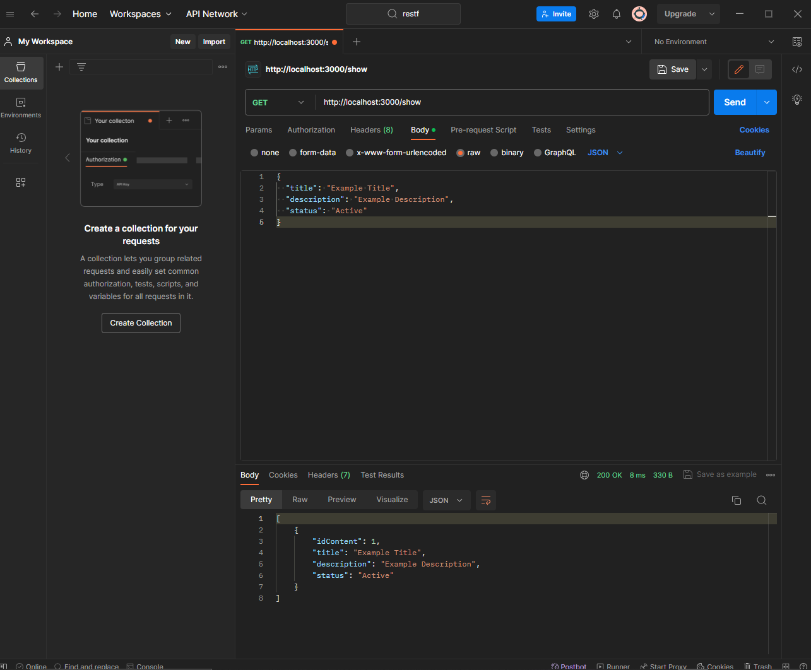
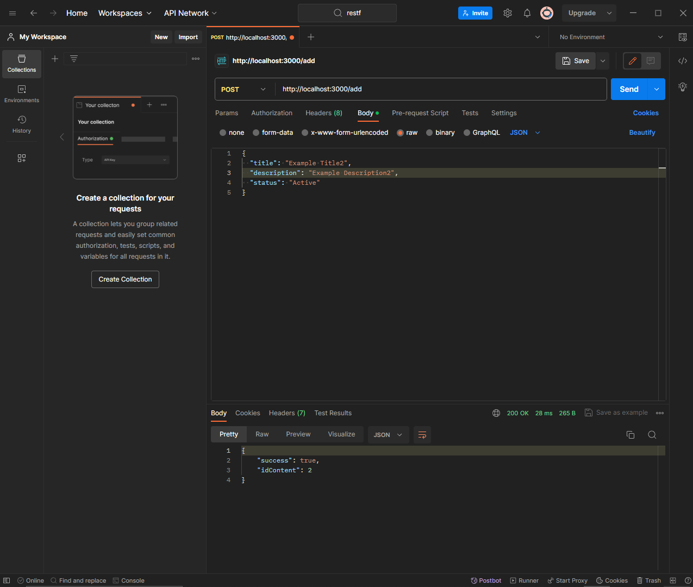
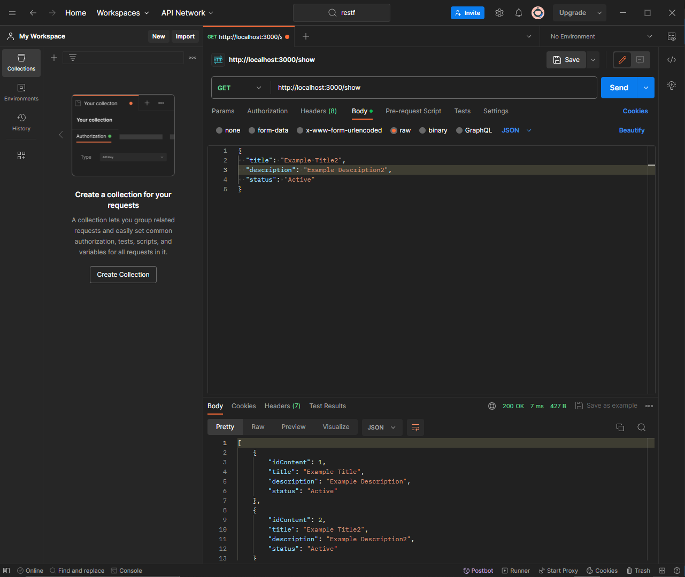
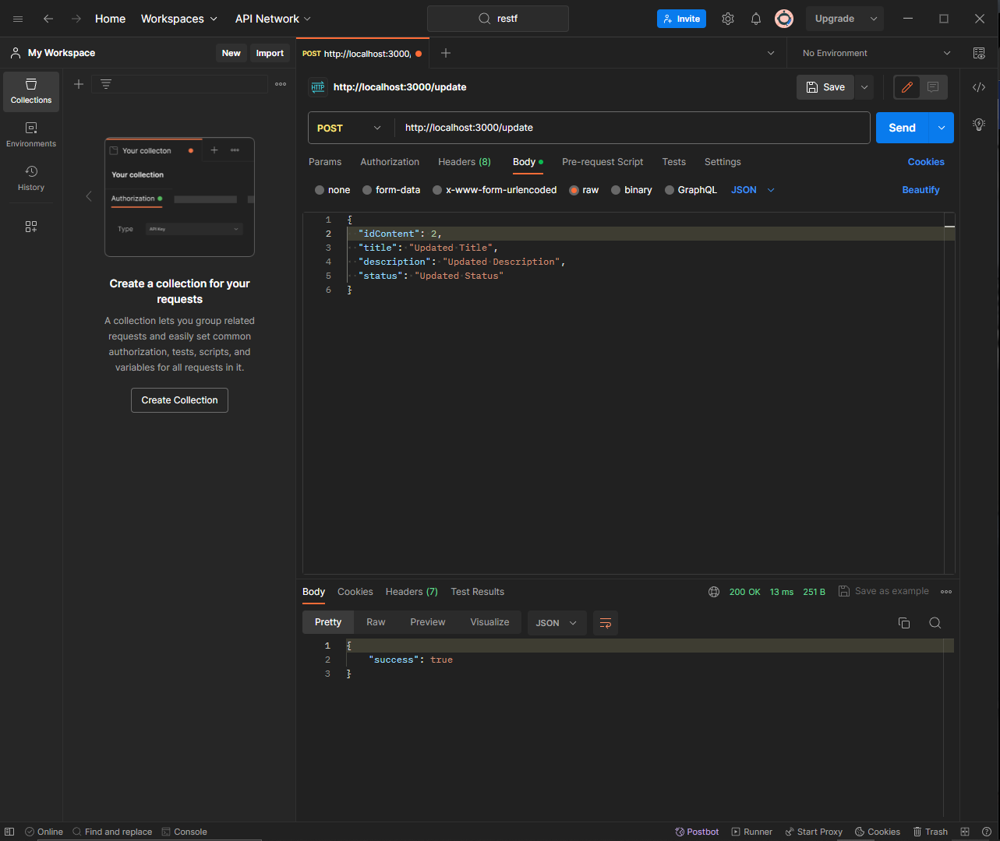
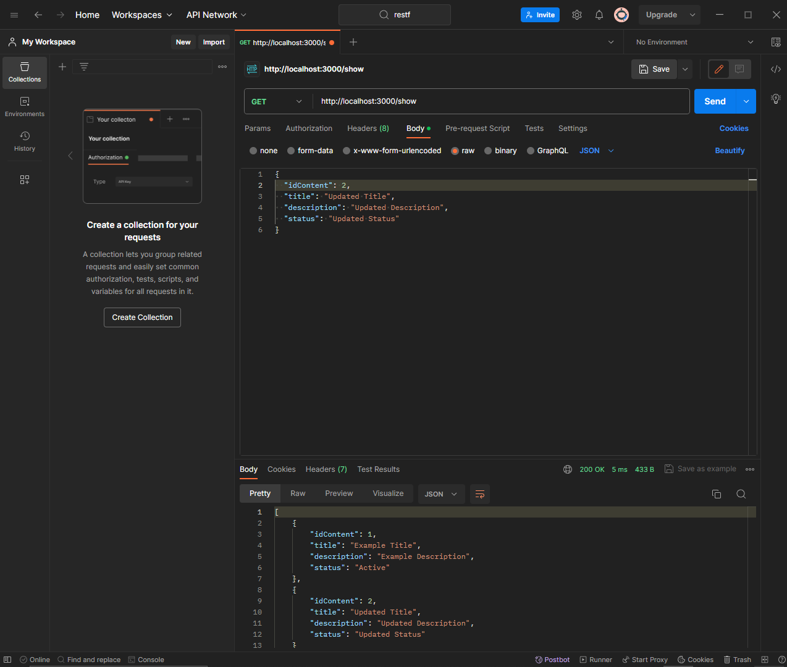
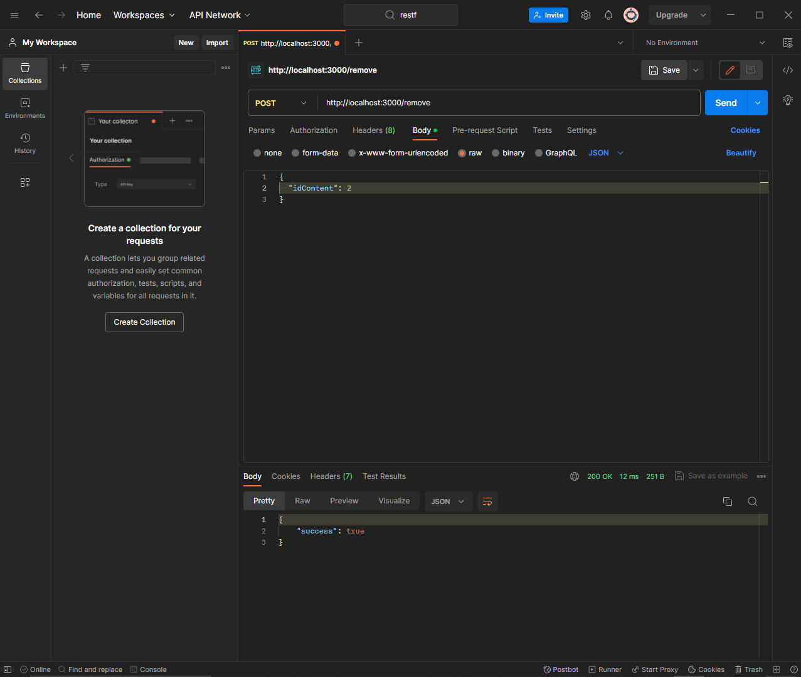
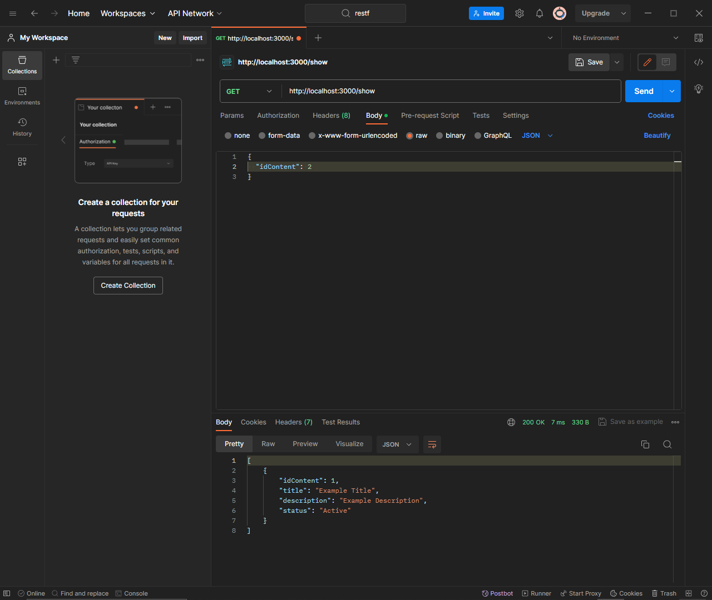
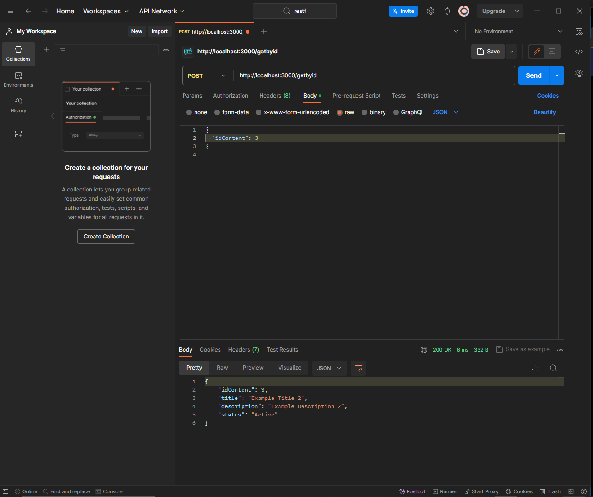

# Тестування працездатності системи

_В цьому розділі необхідно вказати засоби тестування, навести вихідні коди тестів та результати тестування._

### Вивод усіх елементів з таблиці content

### Додаємо елемент до таблиці content

### Вивод результату з усіма елементіами з таблиці content

### Оновили елемент з таблиці content

### Вивод результату з усіма елементіами з таблиці content

### Виделення елементу з таблиці content

### Вивод результату з усіма елементіами з таблиці content

### Пошук елементу за його ідинтифікатором з таблиці content

